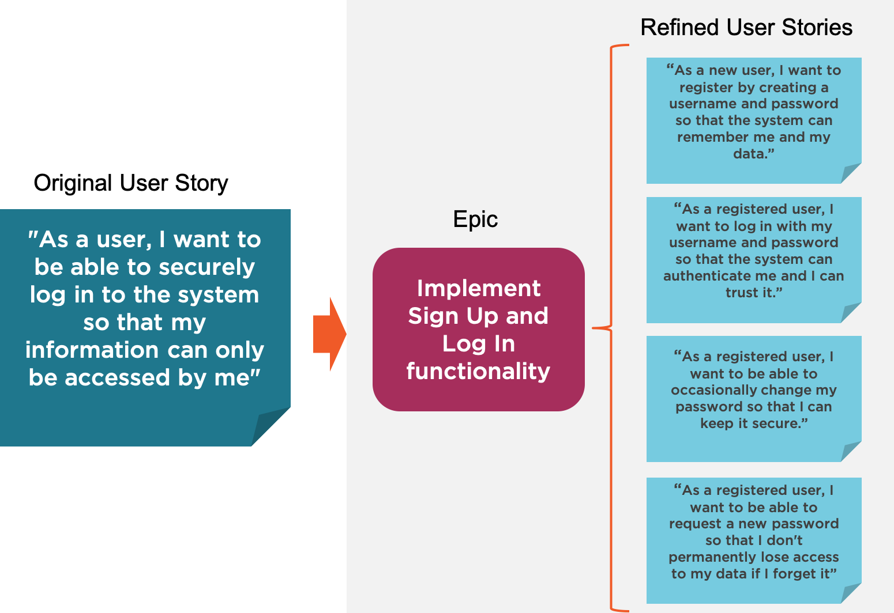

# Refining User Stories [1]

> An Agile backlog is meant to be a living body of information. Therefore, it is not necessary that all user stories be broken down into smaller and refined stories with corresponding estimates and acceptance criteria right from the onset of the project. It is important, however, that at any moment in time there are enough refined stories in the backlog ready to be added to the next sprint or backlog iteration.

1. Think about the amount of work involved in implementing the functionality. 

This epic will then include the following smaller user stories:

- As a new user, I want to register by creating a username and password so that the system can remember me and my data.-

- As a registered user, I want to log in with my username and password so that the system can authenticate me and I can trust it.
- As a registered user, I want to be able to occasionally change my password so that I can keep it secure.
- As a registered user, I want to be able to request a new password so that I don't permanently lose access to my data if I forget it.
These smaller user stories are now more precise and refined in their scope and are more likely to fit each within a single sprint.

## Acceptance Criteria

The acceptance criteria determine the specific conditions that the software product must satisfy to be accepted by and meet the expectations of the user. It also forms the basis for the acceptance testing stage.

During the refinement process, as larger user stories become epics and are broken down into smaller scoped user stories, it becomes easier to reason about the acceptance criteria and come up with a shortlist for each user story (less than five criteria listed, ideally one to three criteria as a good rule of thumb). If the list of acceptance criteria for any user story is too big, it may be an indication that the user story is too large in scope and should probably be split further.

Some guiding principles for defining acceptance criteria are:

- Each acceptance criterion should be independently testable
- Each acceptance criterion test should have a clear pass/fail result
- Acceptance criteria should be focused on the end result (functionality), not the mechanism through which it is achieved
- When relevant, "hidden" non-functional criteria should be included
An acceptance criterion is often expressed as a sentence following the structure:

"Given [precondition], when I [do some action] then I expect [result]”.

In the example above, the acceptance criteria for the first two stories could be:

|User Story| Acceptance Criteria|
|:-- |:--|
|As a new user, I want to register by creating a username and password so that the system can remember me and my data.|	Given that I am a new user, when I go to the sign up page and enter an username and password and click on sign up, then I am successfully registered and able to log in with my chosen credentials.|
| As a registered user, I want to log in with my username and password so that the system can authenticate me and I can trust it.| 1. Given that I am a registered user and logged out, if I go to the log in page and enter my username and password and click on Log in, then the data associated to my user should be accessible.2. Given that I am a registered user and logged out, if I go to the log in page and enter my username but an incorrect password and click on Log in, then log in fails with an error message that specifies that the username or password was wrong.|

### Adding Non-functional Requirements

A good practice in defining acceptance criteria is to also include non-functional requirements, i.e., requirements related to the system's qualities and attributes that are not necessarily directly related to the functionality, but are crucial in meeting the user's expectations in regards to the system's behavior.

For example, building on the list of acceptance criteria for the user story:

"As a registered user, I want to log in with my username and password so that the system can authenticate me and I can trust it."

We can add as a criterion:

"Given that I am a registered user and logged out, if I go to the login page and enter my username and password and click on Log in, then my user login session is loaded in less than eight seconds."

This criterion captures two underlying qualities of the system's design, namely:

High-availability (the request cannot timeout due to there not being available resources), and
Scalability (the request cannot take too long because the servers can't handle the load).
A non-functional requirement could also be captured into a new user story added to the same parent epic, especially when it involves a new functionality entailing implementation work by the developers. An example, related to the security of user's accounts, would be:

"As a registered user, I want to be notified if there have been three unsuccessful login attempts against my username so that I can take action to secure my account."

Although not specifically stated by any user, such "non-functional" capabilities are simply expected as common sense, or sometimes they may be included by the product owner as something seen as design or security best practice.

### Other ways to refine
Finally, it is worth noting that refining user stories is not only about sizing and splitting larger stories into smaller ones, but can also involve the following tasks:

- Removing user stories that are no longer deemed relevant
- Reviewing and re-assessing the priority of stories
- Assigning estimates to stories which have not yet been assigned one
- Correcting estimates based on new information
- Adding, editing, or removing acceptance criteria based on new discussions

[1]: https://www.pluralsight.com/guides/refine-user-stories-and-acceptance-criteria-with-agile
